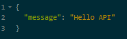
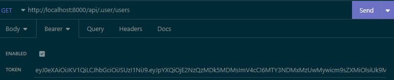

# ProjetDevFrontArhurPhillipe

D'abord cloner le projet.

Une fois cloner faire un git branch Arthur (le projet se situe dans cette branche la)

Une fois dans la branche Arthur, dans les dossier my-lib-ui, proxy et vitrine faite un npm install pour télécharger les dépendances du projet.

Pour lancer les storybook, aller dans le dossier my-lib-ui puis faite un npm run storybook.

Pour lancer le projet, vous devez d'abord faire un docker compose build up -d.

Une fois que le Docker est en marche, faite cette commande docker compose exec user bash et une fois dans le terminal lancer cette commande composer install.

Le proxy sera automatiquement en marche avec Docker, dans le dossier vitrine faite npm run dev pour lancer la page.

# Rendu N°2
- Liste des captures d'écran d'Insomia:
  - API Default
    - Requête:
    - 
    - Réponse:
    - 
  - API User Default
    - Requête:
    - 
    - Réponse:
    - 
  - API Login
    - Requête:
    - 
    - Réponse:
    - 
  - API Get User
    - Requête:
    - 
    - Réponse:
    - 
  - API Check Role
    - Requête:
    - 
    - Token:
    - 
    - Réponse:
    - 
  - API Check Admin
    - Requête:
    - 
    - Réponse:
    - 
  - API Future User
    - Requête:
    - 
    - Réponse:
    - 
  - API New User
    - Requête:
    - 
    - Réponse:
    - 
  - API Valid User
    - Requête:
    - 
    - Token:
    - 
    - Réponse:
    - 
  - API All Users
    - Requête:
    - 
    - Réponse:
    - 

- Admin 
  - Connexion:
  - 
  - Validation:
  - 
  - Validé:
  - 

# Rendu N°3
- Car
  - Ajouter une voiture :
    - 
  - Supprimer une voiture :
    - 
  - Avant la suppression:
    - 
  - Après la suppression :
    - 
- Electron
  - Login:
    - 
  - All Cars:
    - 
  - One Car:
    - 
